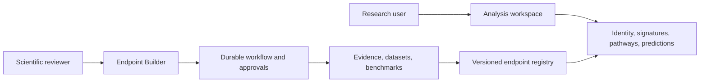
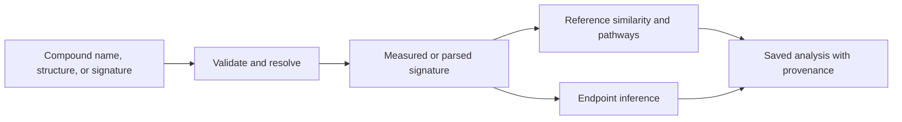

# EndoScan — A platform for analyzing cellular responses to chemicals and building biological-risk models

[](https://github.com/Rirkella/endoscan-platform/actions/workflows/ci.yml)

EndoScan is an internal research platform for two connected jobs: interpreting how a chemical perturbs cellular gene expression, and building reproducible endpoint-specific prediction models from reviewed public evidence. It combines a React application, a FastAPI service, deterministic scientific pipelines, durable workflow orchestration, bounded provider tools, immutable artifacts, and explicit human approval gates.

The repository is a working demonstrator and engineering foundation—not a validated clinical, regulatory, or safety decision system. Current endpoint models and offline workflow fixtures are experimental. See [status and roadmap](docs/STATUS_AND_ROADMAP.md) and [scientific limitations](docs/SCIENTIFIC_LIMITATIONS.md) before interpreting results.

## Why this exists

Early toxicological assessment is expensive and experimentally intensive. Conventional QSAR approaches evaluate a compound primarily from chemical structure; EndoScan starts from the measured response of cells: a vector describing how the activity of thousands of genes changed after exposure. A single profile can reflect several biological processes and is difficult to interpret directly. Chemical-risk work also spans disconnected assay catalogues, perturbational transcriptomics, identifier systems, notebooks, and model registries.

EndoScan makes those boundaries visible and reproducible. Its product hypothesis is that a measured cellular response, interpreted by endpoint-specific models and transparent reference evidence, can provide earlier and more biologically contextual research signals than structure alone. It aims to answer two questions:

1. **What cellular response is associated with this chemical?** Resolve a compound, retrieve or parse a measured expression signature, compare it with reference profiles, and surface pathways and model predictions with provenance.
2. **Can we build a defensible model for a biological endpoint?** Specify the scientific claim, discover and hydrate evidence, measure joinability, review an assembly strategy, build a dataset, benchmark models, and publish only after human approval.

## Biological concepts in plain language

- A **chemical identity** is a canonical structure plus mappings back to source identifiers. Names alone are not sufficient.
- A **transcriptomic signature** records genes whose expression changes after a compound exposure in a particular biological context, dose, and duration.
- An **activity endpoint** is a precisely defined prediction claim, such as binding, agonism, antagonism, or a separately approved derived functional label.
- **Modality** describes what an assay measured. Raw binding, agonism, and antagonism observations remain distinct during discovery.
- **Joinability** asks whether activity observations and expression profiles can be connected through verified compound identifiers without inventing mappings.
- A **model result** is conditional on the endpoint definition, training data, split design, feature space, and applicability domain.

## Intended users

- Computational toxicologists and bioinformaticians exploring chemical-response evidence.
- Data scientists constructing and benchmarking endpoint datasets.
- Scientific reviewers approving definitions, evidence inventories, assembly policies, and model publication.
- Platform engineers extending providers, workflow contracts, jobs, APIs, or the Admin Console.

The primary product user is a toxicologist, preclinical-safety specialist, or research team applying ready-made reviewed models—not someone expected to construct an ML pipeline manually.

## D4GEN origin and current scope

An earlier D4GEN 2026 hackathon prototype demonstrated the core product idea. This repository is the clean, auditable implementation that followed: it preserves the demonstrator value while replacing ad hoc orchestration with typed contracts, durable state, bounded source access, replayable artifacts, tests, and review gates. Historical implementations remain available through Git history and are not alternate production paths in the current tree.

## Two connected layers



The **analysis layer** serves existing endpoint models and chemical-response evidence through `/analyze`, Projects, Model Library, and Explore. The **endpoint-building layer** creates candidate registry entries through a governed lifecycle in the Admin Console. They share contracts, the artifact model, endpoint registry, and APIs, but an analysis request cannot silently trigger model-building work.

The analysis layer accepts a measured profile, validates and normalizes it, runs registered models, and returns endpoint scores/calls, important genes or features, biological-process context, applicability, provenance, and limitations. Explore exposes aggregated public reference data and UMAP/PCA views where reviewed artifacts exist. EndoScan does not issue an unsupported final verdict such as “safe” or “toxic.”

The internal factory is for developers and scientific maintainers. It verifies data, computes valid combinations, proposes assembly strategies, and requires review before dataset assembly, benchmarking, validation, and publication. One registry endpoint represents one defined biological-risk prediction task and one selected model version. Selection is evidence-driven: Logistic Regression, Random Forest, or Gradient Boosting may be more reliable than a complex neural network for a particular dataset.

## User analysis lifecycle



Saved analyses retain their analysis ID, endpoint, active result tab, and cached results across refresh and browser navigation. Restore does not intentionally recompute analysis or repeat PubMed work. The web application exposes Home, Analyze, Projects, Model Library, Explore, and the restricted Admin Console.

## Endpoint-building lifecycle

The governed path is specification → discovery plan → metadata discovery and hydration → deterministic combination coverage → strategy review → approved assembly → dataset review → training approval → benchmark review → registry publication. Agents may propose structured work; deterministic code executes source and data operations; humans authorize irreversible scientific decisions.

An agentic approach is used where the search space and source language are variable: decomposing a reviewed goal, proposing bounded searches, identifying gaps, and synthesizing strategy alternatives. Agents do not calculate scientific tables or confer authority. Deterministic code validates contracts, retrieves and parses sources, resolves approved identifiers, computes coverage, assembles data, trains, evaluates, and fingerprints. Humans approve specification semantics, source access, aggregation/labels, datasets, training, scientific acceptance, and publication.

The platform works with five data categories: laboratory activity measurements; chemical identity and structure mappings; compound-induced cellular-response profiles; additional public studies; and supporting metadata/publications. Row-level payloads remain immutable artifacts with source provenance.

Read the exact states and contracts in [Endpoint Building Workflow](docs/ENDPOINT_BUILDING_WORKFLOW.md).

## Architecture at a glance

- `apps/web` — React, TypeScript, Vite user and admin interface.
- `services/api` — FastAPI routes and dependency composition.
- `packages/endoscan_core` — endpoint registry, features, inference, training, and diagnostics.
- `packages/endoscan_workflows` — SQLite/Alembic workflow state, approvals, providers, artifacts, and lifecycle services.
- `packages/endoscan_jobs` — bounded heavy-data jobs and local storage contracts.
- `registry` and `models` — versioned endpoint metadata and reviewed serving artifacts.
- `tests` — unit, API, workflow, staging, and regression coverage.

The durable control plane uses SQLite in the local demonstrator. Scientific payloads and raw provider responses are content-addressed artifacts rather than opaque database blobs. See [Architecture](docs/ARCHITECTURE.md), [Data Model and Artifacts](docs/DATA_MODEL_AND_ARTIFACTS.md), and [Provider Architecture](docs/PROVIDER_ARCHITECTURE.md).

## Where the agentic pipeline lives

| Component | Location | Responsibility |
|---|---|---|
| Workflow orchestrator | [`service.py`](packages/endoscan_workflows/endoscan_workflows/service.py) | Coordinates lifecycle, approvals, and publication |
| Agent runtime | [`harness.py`](packages/endoscan_workflows/endoscan_workflows/harness.py) | Executes bounded model turns and reviewed tools |
| Discovery agent | [`discovery.py`](packages/endoscan_workflows/endoscan_workflows/discovery.py) | Plans and evaluates bounded source discovery |
| Dataset/review agents | [`training_dataset.py`](packages/endoscan_workflows/endoscan_workflows/training_dataset.py) | Produces typed proposals and review artifacts |
| Strategy agent | [`endpoint_lifecycle.py`](packages/endoscan_workflows/endoscan_workflows/endpoint_lifecycle.py) | Proposes source-bound assembly strategies |
| OpenAI adapter | [`openai_provider.py`](packages/endoscan_workflows/endoscan_workflows/openai_provider.py) | Connects the OpenAI Agents SDK |
| Tool registry | [`tools.py`](packages/endoscan_workflows/endoscan_workflows/tools.py) | Exposes allowlisted deterministic tools |
| State machine | [`state_machine.py`](packages/endoscan_workflows/endoscan_workflows/state_machine.py) | Enforces lifecycle transitions |

Agents propose structured work; deterministic code executes scientific operations; human reviewers authorize scientific decisions.

## Quick start

Prerequisites: Python 3.12, [uv](https://docs.astral.sh/uv/), Node.js 24, and npm. No API key or scientific network access is needed for setup, tests, or offline demos.

```bash
uv run python scripts/project.py setup
uv run python scripts/project.py dev
```

The API listens on `http://127.0.0.1:8001`; Vite prints the local web URL. On systems with Make, `make setup` and `make dev` are equivalent wrappers. Commands are defined in `scripts/project.py`, so Windows, macOS, Linux, and CI use the same task graph.

Useful checks:

```bash
uv run python scripts/project.py test
uv run python scripts/project.py typecheck
uv run python scripts/project.py demo
uv run python scripts/project.py verify
```

See [Development](docs/DEVELOPMENT.md) for environment details and [Testing](docs/TESTING.md) for the validation matrix.

## Offline demonstrations

Two deterministic fixtures exercise the complete governed lifecycle without OpenAI calls or scientific-source network requests:

```bash
uv run python scripts/project.py demo-tr
uv run python scripts/project.py demo-dna-damage
```

They create local, ignored artifacts under `.builds/offline-endpoint-demo/`. Fixture evidence is prepared test data, not a live scientific discovery or a claim that the thyroid-receptor or DNA-damage datasets are validated. Follow [Offline Demo](docs/OFFLINE_DEMO.md) for outputs and interpretation.

## Providers and data sources

Reviewed adapters cover PubChem BioAssay, EPA ToxCast/invitroDB public releases, Tox21, NCBI GEO, LINCS L1000 metadata, PubChem Compound, and NCBI supporting metadata. Each provider has a typed operation, allowlisted locator or release manifest, pagination/completion proof, cache key, provenance record, and explicit heavy-data boundary. Source families are not assumed to contain equivalent records.

Live access is optional and separately authorized. Technical live-smoke evidence exists for selected Tox21, PubChem, GEO, and ToxCast paths; LINCS and supporting-metadata live acceptance remains incomplete. No broad thyroid-receptor end-to-end discovery success is claimed. See the [provider status matrix](docs/STATUS_AND_ROADMAP.md#canonical-status-matrix).

## Human review and safety boundaries

Human approvals protect scientific definition, source discovery, assembly strategy, dataset use, training, and publication. Approval objects are version-bound and consumed transactionally. Tool access is registry-based, arguments are typed, URLs are not freely model-generated, domains and response sizes are bounded, secrets are redacted, provider retries default to zero on the live acceptance path, and immutable events preserve the audit trail.

Read [Security](docs/SECURITY.md) for the threat model. EndoScan must not be exposed as an unauthenticated public service in its current form.

## Reproducibility

Locked dependencies, typed immutable contracts, content hashes, source/release metadata, deterministic assembly recipes, persisted budgets, dataset fingerprints, benchmark artifacts, and registry manifests support replay. A replay demonstrates pipeline consistency; it does not prove source correctness or biological validity. See [Reproducibility](docs/REPRODUCIBILITY.md).

## Testing and quality gates

CI and `scripts/project.py verify` gate Python/frontend tests, Ruff lint and format, bounded mypy, TypeScript, production build, repository/docs hygiene, and both offline lifecycle demonstrations. Live providers are deliberately excluded from routine CI. Details are in [Testing](docs/TESTING.md).

## Current status

Implemented and offline-validated foundations include the analysis UI/API, ER and AR experimental serving entries, durable workflow control plane, reviewed provider contracts, discovery/hydration/coverage/strategy stages, human gates, heavy-data jobs, deterministic assembly, training/evaluation plumbing, registry publication, and two complete offline lifecycle fixtures.

Still pending are scientific validation of endpoint datasets and models, repeatable end-to-end live discovery acceptance, broader live-provider coverage, production authentication/authorization, multi-user database deployment, operational monitoring, and current UI screenshot capture. Exact evidence and non-claims live in [Status and Roadmap](docs/STATUS_AND_ROADMAP.md).

Live attempts have exposed real integration and source-query edge cases; they are preserved as evidence and future acceptance work, not relabeled as completed discovery.

## Repository layout

| Path | Current purpose |
|---|---|
| `.github/` | CI, Docker smoke, and explicitly dispatched heavy-job workflows |
| `.dvc/`, `.dvcignore` | Metadata for the optional DVC-tracked LINCS staging artifact |
| `apps/` | Browser applications; `apps/web` owns the React user interface and Admin Console |
| `packages/` | Installable domain, workflow, and job packages |
| `services/` | Deployable service composition; `services/api` owns FastAPI |
| `registry/` | Reviewed provider, policy, endpoint, and model metadata |
| `pipelines/` | Deterministic ER/AR reproduction configs and staging helpers, not workflow orchestration |
| `data/` | Small reviewed serving/reference assets and a DVC pointer for the omitted LINCS matrix |
| `models/` | Reviewed ER/AR serving artifacts loaded by the API |
| `scripts/` | Maintained commands, offline demos, and explicit artifact-extraction utilities |
| `tests/` | Cross-package regression, integration, scientific-invariant, and fixture tests |
| `docs/` | Canonical architecture, workflow, provider, operations, status, and decision records |

Generated workflow state, source caches, scientific downloads, logs, reports, datasets,
demo outputs, and unreviewed models are ignored. See [Architecture](docs/ARCHITECTURE.md#repository-map)
and [Reproducibility](docs/REPRODUCIBILITY.md#repository-data-and-model-assets) for ownership
and storage details.

## Repository documentation

- [Architecture](docs/ARCHITECTURE.md)
- [Endpoint Building Workflow](docs/ENDPOINT_BUILDING_WORKFLOW.md)
- [Provider Architecture](docs/PROVIDER_ARCHITECTURE.md)
- [Data Model and Artifacts](docs/DATA_MODEL_AND_ARTIFACTS.md)
- [Admin Console Guide](docs/ADMIN_CONSOLE_GUIDE.md)
- [Offline Demo](docs/OFFLINE_DEMO.md)
- [Development](docs/DEVELOPMENT.md)
- [Testing](docs/TESTING.md)
- [Reproducibility](docs/REPRODUCIBILITY.md)
- [Scientific Limitations](docs/SCIENTIFIC_LIMITATIONS.md)
- [Security](docs/SECURITY.md)
- [AI-assisted development](docs/AI_ASSISTED_DEVELOPMENT.md)
- [Contributing](CONTRIBUTING.md)
- [Status and Roadmap](docs/STATUS_AND_ROADMAP.md)
- [Architecture decisions](docs/decisions/README.md)

## Screenshots

The repository contains a production hero asset but no reviewed screenshot package covering the complete application and Admin Console. The final audit could not attach a reliable browser capture surface, so it deliberately published no stale or synthetic images. The required views and acceptance criteria remain listed in the [Admin Console Guide](docs/ADMIN_CONSOLE_GUIDE.md#screenshot-gap).

## Roadmap

The consolidated repository, documentation and offline verification audit is complete. Remaining gates are current interactive browser evidence, complete bounded provider acceptance, one evidence-backed joinability demonstration, endpoint-by-endpoint scientific validation, and production security/deployment hardening. The detailed sequence and status ownership are in [Status and Roadmap](docs/STATUS_AND_ROADMAP.md).

## Contributing and governance

Start with [Contributing](CONTRIBUTING.md). Changes to scientific semantics require typed contracts, fixture evidence, deterministic tests, provenance preservation, and an architecture decision when they alter a durable boundary. Never commit keys, live databases, source downloads, provider caches, or machine-local paths.

## License

Copyright © 2026 Irina Andriushchenko. This repository is proprietary and confidential; copying, modification, distribution, or use requires express written permission. Outputs are research signals subject to the limitations above. See [LICENSE](LICENSE). Accurate repository-level citation metadata is available in [CITATION.cff](CITATION.cff); it intentionally declares no DOI, publication, affiliation, or release version.

`main` is the authoritative development branch. Historical phase branches, reports, backups, and legacy prototypes are preservation evidence, not alternate current implementations.
