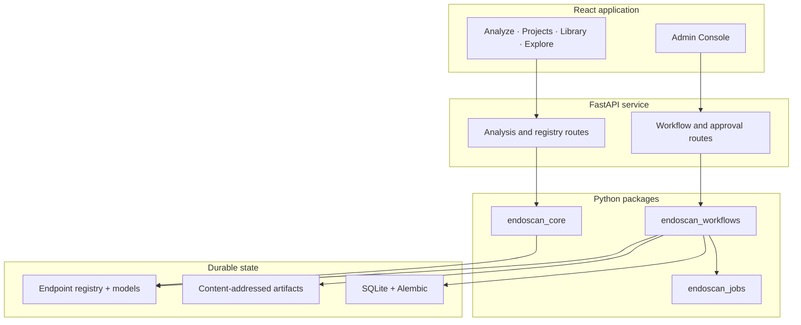
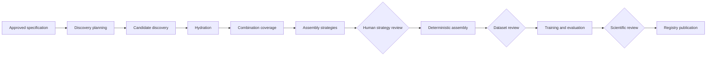
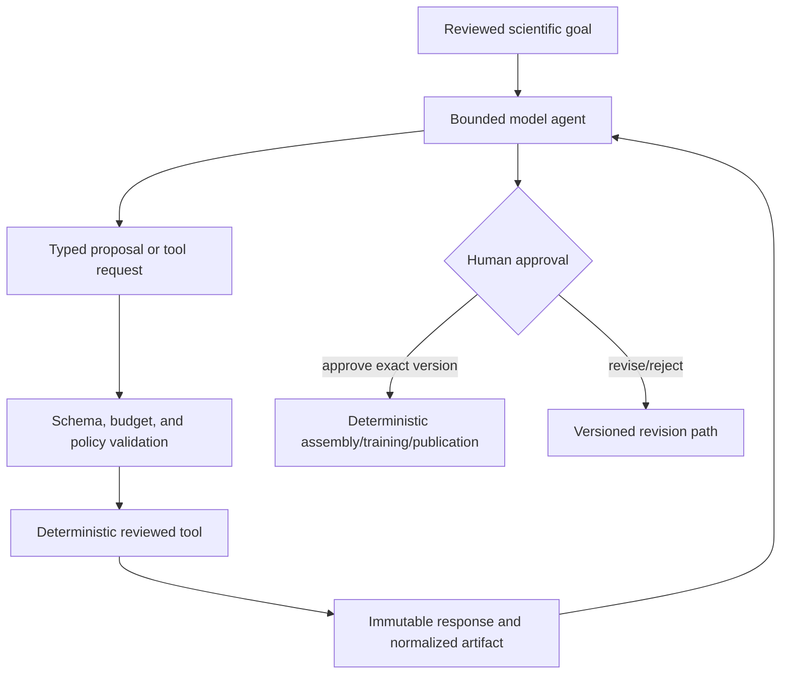
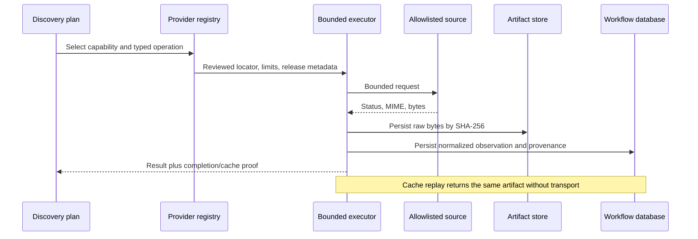
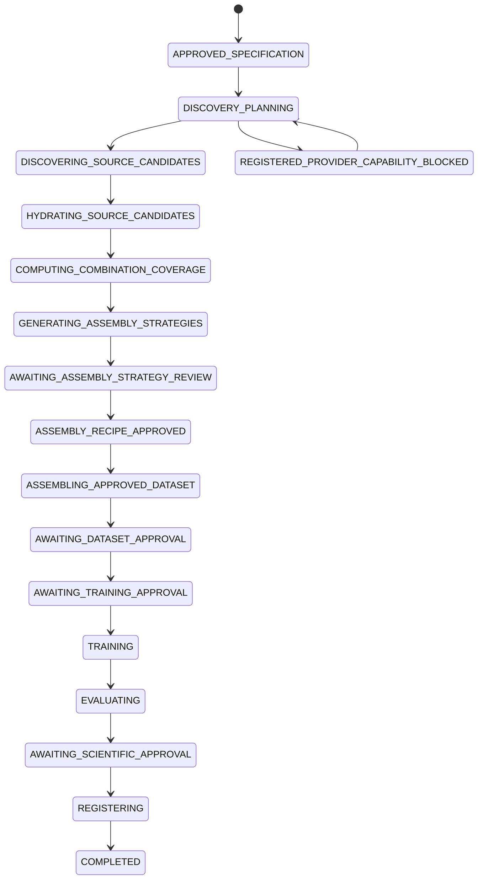
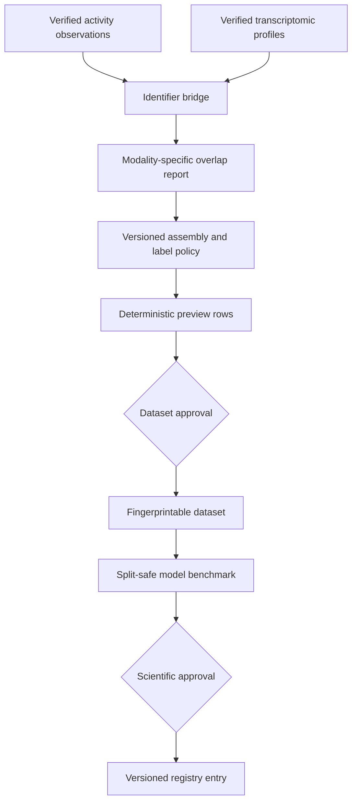
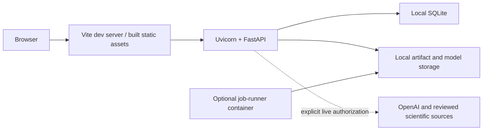

# Architecture

## System boundary

EndoScan is a modular monorepo with two product surfaces over shared scientific and workflow foundations. The analysis surface interprets compounds against already registered endpoints. The endpoint-building surface constructs new versioned candidates under durable state and human review. The current deployment target is an internal, single-tenant demonstrator; SQLite and local content-addressed storage are deliberate local defaults, not a claim of multi-user production readiness.



## Repository map

| Path | Responsibility |
|---|---|
| `apps/web` | React/TypeScript/Vite application and browser tests |
| `services/api` | FastAPI composition, public analysis routes, admin workflow routes |
| `packages/endoscan_core` | Registry, feature contracts, inference, training, evaluation, diagnostics |
| `packages/endoscan_workflows` | Durable state, typed contracts, providers, discovery, approvals, artifacts |
| `packages/endoscan_jobs` | Bounded heavy-data extraction, identity, coverage, fusion, Explore-map jobs |
| `registry`, `models` | Reviewed serving metadata and endpoint artifacts |
| `data/catalogue`, `data/reactome` | Small reviewed reference data committed for serving |
| `pipelines/endpoints` | Deterministic ER/AR reproduction configs and staging helpers; not orchestration |
| `scripts` | Cross-platform commands, offline demos, maintenance and validation |
| `tests` | Cross-package integration and regression tests |
| `docs` | Current architecture, workflow, provider, operations, policy, and ADR sources of truth |

Package dependencies point inward: the API composes packages; workflows may call core and jobs through typed boundaries; core has no web or workflow dependency. Provider transport is isolated from scientific normalization. The frontend consumes API contracts and never reads SQLite or artifacts directly.

`packages/endoscan_workflows` is the sole current workflow and agent-integration owner. The
former root `agent/` package was a file-backed predecessor with no production API import; it
and its isolated tests were removed after semantics-v2 superseded it. Git history preserves
that implementation. `pipelines/` remains because its runner, endpoint configuration, and
staging transforms reproduce the existing ER/AR assets; it does not own durable state,
provider execution, approvals, or the endpoint lifecycle.

### Public-root inventory

Each retained root item has one current owner. Classification names are used by the public
repository cleanup audit.

| Item | Classification | Reason retained |
|---|---|---|
| `.github/` | `KEEP_AND_DOCUMENT` | CI, Docker smoke, and manual heavy-job automation |
| `.dvc/`, `.dvcignore` | `KEEP_AND_DOCUMENT` | DVC metadata for the intentionally omitted LINCS staging matrix |
| `.env.example` | `KEEP_IN_ROOT` | Safe configuration inventory without credentials |
| `.gitignore` | `KEEP_IN_ROOT` | Repository-wide generated, runtime, secret, and scientific-data exclusions |
| `.pre-commit-config.yaml` | `KEEP_IN_ROOT` | Local Ruff and repository-quality hooks |
| `.python-version` | `KEEP_IN_ROOT` | Canonical Python version for `uv` |
| `apps/` | `KEEP_AND_DOCUMENT` | Browser application owner |
| `packages/` | `KEEP_AND_DOCUMENT` | Installable core, workflow, and job packages |
| `services/` | `KEEP_AND_DOCUMENT` | Deployable API composition |
| `registry/` | `KEEP_AND_DOCUMENT` | Reviewed source, policy, endpoint, and model metadata |
| `pipelines/` | `KEEP_AND_DOCUMENT` | Existing endpoint reproduction assets, not a competing orchestrator |
| `data/` | `KEEP_AND_DOCUMENT` | Reviewed runtime references, small endpoint tables, and DVC pointers |
| `models/` | `KEEP_AND_DOCUMENT` | Reviewed serving artifacts referenced by the endpoint registry |
| `scripts/` | `KEEP_AND_DOCUMENT` | Maintained task runner, verification, demos, and explicit extractors |
| `tests/` | `KEEP_AND_DOCUMENT` | Cross-package and scientific-invariant verification |
| `docs/` | `KEEP_AND_DOCUMENT` | Canonical public documentation and decisions |
| `README.md` | `KEEP_IN_ROOT` | GitHub entry point |
| `CONTRIBUTING.md` | `KEEP_IN_ROOT` | Conventional contributor entry point linking to detailed guidance |
| `CITATION.cff` | `KEEP_IN_ROOT` | Accurate software-repository citation metadata without invented publication fields |
| `LICENSE` | `KEEP_IN_ROOT` | Repository usage terms |
| `Makefile` | `KEEP_IN_ROOT` | Optional thin aliases over the canonical Python task runner |
| `pyproject.toml`, `uv.lock` | `KEEP_IN_ROOT` | Single Python workspace/tooling declaration and exact lock |
| `Dockerfile`, `docker-compose.yml` | `KEEP_IN_ROOT` | Heavy-job image and its local profile |

The obsolete root `agent/`, `legacy/`, `notebooks/`, and `reports/` directories were
classified `DELETE_PROVEN_OBSOLETE`: none supplied a current production import or unique
runtime registration. Local `.endoscan/`, caches, downloads, reports, logs, demo outputs,
patches, and bundles are `GENERATED_AND_MUST_BE_IGNORED` and do not appear on GitHub.

## Analysis request path

```mermaid
sequenceDiagram
  actor User
  participant Web as React application
  participant API as FastAPI
  participant Core as Core inference
  participant Registry as Endpoint registry
  participant Cache as Saved analysis state
  User->>Web: Submit compound or signature
  Web->>API: Validate, resolve, analyze
  API->>Registry: Load endpoint manifest/model
  API->>Core: Parse features and infer
  Core-->>API: Prediction, diagnostics, explanation
  API-->>Web: Typed result with provenance
  Web->>Cache: Persist analysis ID and view state
  Note over Web,Cache: Refresh restores cached result; no implicit recomputation
```

Chemical identity and measured-expression provenance remain visible. Registry schema validation prevents loading incompatible feature spaces. Explanations describe model behavior, not biological causality.

## Endpoint lifecycle and control plane



Every transition is checked by the state machine. Workflows, steps, approvals, budgets, agent runs, provider diagnostics, immutable events, and artifact references are persisted. Restart recovery resumes from persisted state; it does not replay already completed external work merely because the UI refreshed.

## Agent, deterministic code, and human boundary



The model cannot create arbitrary URLs, bypass tool schemas, consume an approval for a different version, or publish a model directly. A fixture-backed deterministic provider drives offline tests. The OpenAI Agents SDK adapter implements the same provider-neutral interface and is selected only by explicit live configuration.

## Provider and artifact flow



Heavy matrices, assay tables, and archives are represented by manifests during metadata discovery. Dedicated jobs operate only after the relevant approval and maintain their own checksums, row counts, and failure records.

## Durable state machine

The executable transition policy is packaged with its runtime at
`packages/endoscan_workflows/endoscan_workflows/workflow-state-machine.json` and loaded
through `canonical_workflow_graph_path()`. Documentation illustrates that contract but is
not an executable configuration source.



Failure and revision states exist alongside this happy path and retain partial evidence. A missing provider capability, zero candidates, unavailable join key, rejected approval, invalid model output, or deterministic job error is represented explicitly rather than silently promoted.

## Dataset assembly and benchmark path



Original assay rows are preserved. Binding is not silently equated with functional activity. An agonism-or-antagonism union is permitted only when a versioned `ModalityAggregationPolicy` is proposed during assembly/curation and approved by a human. Coverage is reported before aggregation.

## Runtime and deployment boundary



Local development uses `scripts/project.py dev`. The root Dockerfile and Compose profile package the heavy-job runner only. API/web deployment images, production identity, network policy enforcement, a server-grade database, object storage, backup operations, and observability remain future deployment work; see [Status and Roadmap](STATUS_AND_ROADMAP.md).

## Cross-cutting invariants

- Scientific-source records retain source system, release/version, locator, retrieval time, raw artifact hash, and normalized provenance.
- State transitions, approval creation/consumption, and artifact references are transactionally durable.
- Discovery preserves source modality. Aggregation belongs to reviewed assembly policy.
- Model/provider output is untrusted until parsed into strict typed contracts.
- External calls are allowlisted, bounded, observable, cached, and never initiated by browser restore.
- Runtime data, secrets, provider caches, downloads, and local databases are not committed.
- Offline fixtures make execution testable but are never represented as live scientific findings.

## Engineering and MLOps implementation anchors

| Practice | Implementation anchor |
|---|---|
| Monorepo boundaries and locked workspace | [`pyproject.toml`](../pyproject.toml), package `pyproject.toml` files, `uv.lock` |
| Typed lifecycle and provider contracts | [`contracts.py`](../packages/endoscan_workflows/endoscan_workflows/contracts.py), [`discovery_strategy.py`](../packages/endoscan_workflows/endoscan_workflows/discovery_strategy.py) |
| Deterministic transitions and optimistic version checks | [`state_machine.py`](../packages/endoscan_workflows/endoscan_workflows/state_machine.py), [`service.py`](../packages/endoscan_workflows/endoscan_workflows/service.py) |
| Transactional task claiming and restart recovery | [`repository.py`](../packages/endoscan_workflows/endoscan_workflows/repository.py), [`database.py`](../packages/endoscan_workflows/endoscan_workflows/database.py) |
| Immutable storage, SHA-256 and boundary fingerprints | [`artifacts.py`](../packages/endoscan_workflows/endoscan_workflows/artifacts.py), [`source_cache.py`](../packages/endoscan_workflows/endoscan_workflows/source_cache.py) |
| Source request accounting and cache-only replay | [`provider_execution.py`](../packages/endoscan_workflows/endoscan_workflows/provider_execution.py), [`source_security.py`](../packages/endoscan_workflows/endoscan_workflows/source_security.py) |
| Streaming and disk-backed scientific processing | [`lincs_streaming.py`](../packages/endoscan_workflows/endoscan_workflows/lincs_streaming.py), [`gctx.py`](../packages/endoscan_jobs/endoscan_jobs/gctx.py), [`storage.py`](../packages/endoscan_jobs/endoscan_jobs/storage.py) |
| Dataset versioning and deterministic assembly | [`endpoint_lifecycle.py`](../packages/endoscan_workflows/endoscan_workflows/endpoint_lifecycle.py), [`endpoint_building.py`](../packages/endoscan_core/endoscan_core/endpoint_building.py) |
| Compound-grouped splits and reproducible benchmark | [`splits.py`](../packages/endoscan_core/endoscan_core/training/splits.py), [`evaluate_endpoint.py`](../packages/endoscan_core/endoscan_core/training/evaluate_endpoint.py) |
| Model cards, registry and serving verification | [`templates.py`](../packages/endoscan_core/endoscan_core/registry/templates.py), [`schema.py`](../packages/endoscan_core/endoscan_core/registry/schema.py), [`store.py`](../packages/endoscan_core/endoscan_core/registry/store.py) |
| API and browser product surfaces | [`app.py`](../services/api/endoscan_api/app.py), [`apps/web`](../apps/web) |
| Job-runner container and Compose profile | [`Dockerfile`](../Dockerfile), [`docker-compose.yml`](../docker-compose.yml) |
| CI and review workflow | [`ci.yml`](../.github/workflows/ci.yml), [Testing](TESTING.md), [Contributing](CONTRIBUTING.md) |

## Related documentation

- [Endpoint Building Workflow](ENDPOINT_BUILDING_WORKFLOW.md)
- [Provider Architecture](PROVIDER_ARCHITECTURE.md)
- [Data Model and Artifacts](DATA_MODEL_AND_ARTIFACTS.md)
- [Security](SECURITY.md)
- [Architecture decisions](decisions/README.md)
