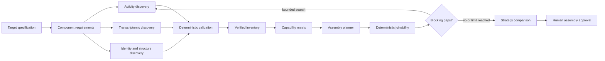

# Training-dataset discovery and assembly

## Purpose and invariant

The workflow designs a scientifically reviewable public-data training table for an arbitrary
toxicology endpoint. It does not assume that one dataset, one activity assay, one transcriptomic
resource, or a fixed two-source join is sufficient.

The authoritative order is:

1. define the target table contract;
2. derive component requirements deterministically;
3. discover candidate sources independently by component role;
4. validate stable source identifiers, access, fields, and provenance;
5. build a verified inventory and deterministic capability matrix;
6. identify missing components and identity bridges;
7. generate concrete strategies only from inventory records;
8. compute joinability diagnostics where exact computation is possible;
9. perform bounded, gap-directed discovery when justified;
10. compare strategies and request human approval.

`DiscoveryBeforeStrategyGuard` rejects planning when the specification, component requirements,
verified inventory, or inventory-bound capability matrix is missing or stale. Every source graph is
checked against that inventory. An undiscovered source can be a gap or search request, never a real
input.

## Target specification and requirements

`TrainingDatasetSpecification` is strict and versioned. It records target and modality, prediction
task and observation grain, acceptable activity and transcriptomic representations, identity and
structure requirements, experimental context, mandatory and optional fields, missingness and
coverage policies, evidence minima, permitted contexts, exclusions, claim scope, unresolved
questions, and assumptions requiring approval.

Continuous activity, potency, efficacy, multiclass, dose-response, and aggregated evidence are
first-class representations; binary labels are not forced. Required table fields connect canonical
compound identity and structure to a compound-induced transcriptomic response, its experimental
context, endpoint activity, assay context, provenance, and quality flags.

The Dataset Specification Agent must expose endpoint ambiguity instead of silently selecting one
mechanism. After human review, `derive_component_requirements` creates a source-neutral ontology for
activity, assay metadata, identity, structure, perturbational transcriptomics, conditions,
controls, mappings, counter-screens, methodological evidence, provenance, and licence. Requirements
describe acceptable forms, identifiers, metadata, quality, substitutes, and dependencies; they do
not name sources.

## Specialized agents and budgets

The durable orchestrator sequences bounded agents with independent contexts:

1. Dataset Specification Agent (planner)
2. Activity Evidence Discovery Agent (worker)
3. Transcriptomic Evidence Discovery Agent (worker)
4. Chemical Identity and Structure Source Discovery Agent (worker)
5. Supporting Metadata Discovery Agent (worker, when needed)
6. Training Dataset Assembly Strategy Planner (planner)
7. Assembly Strategy Evaluation Agent (planner)

Agents never communicate directly. SQLite state and immutable artifacts are the handoff. Only
compact validated documents move forward; prior conversations and hidden chain-of-thought do not.
The trace exposes decision summaries, evidence, unresolved questions, tools, safe diagnostics,
usage, cost, and duration.

Planner and worker providers/models are independently configured with
`ENDOSCAN_PLANNER_PROVIDER`, `ENDOSCAN_PLANNER_MODEL`, `ENDOSCAN_WORKER_PROVIDER`, and
`ENDOSCAN_WORKER_MODEL`. Domain logic contains no provider model name. Per-agent and global turn,
tool, token, cost, retry, gap-round, and timeout budgets remain explicit and auditable. No paid
default is enabled.

## Source adapters, inventory, and capabilities

The reviewed source registry declares general capabilities for official structured activity,
perturbational-transcriptomic, and chemical-identity systems. It contains hosts, operations, roles,
and identifier types, never endpoint-specific answers. Arbitrary URLs and paths are rejected. A
production adapter must be explicitly injected and match the reviewed host definition; an
unconfigured adapter fails closed as `unresolved`.

The production registry has six universal reviewed source families: PubChem BioAssay; EPA CompTox
/ ToxCast; general NCBI GEO studies; dedicated LINCS L1000 metadata and release manifests; PubChem
Compound; and NCBI supporting metadata. Activity discovery can inspect PubChem/Tox21-accessible and
EPA CompTox/ToxCast records without assuming they are identical. Transcriptomic discovery can
inspect both general GEO chemical-perturbation studies and dedicated LINCS L1000 resources without
assuming LINCS is the selected source. Stable identifiers, release provenance and possible
duplicates remain source-bound until deterministic comparison. Discovery performs bounded metadata
GETs only; it does not download bulk activity tables or expression matrices.

Initial discovery inspects bounded metadata and availability. Large result tables and expression
matrices are not downloaded. Literature may clarify terms or locate a primary identifier, but it
cannot replace public primary records or turn prose into exact counts or labels.

`VerifiedSourceInventory` stores stable identifiers, roles, public availability, fields, access and
licence states, references, validation, limitations, unresolved questions, and artifact hashes. A
source may supply several roles, and several sources may supply one role. The deterministic
`SourceCapabilityMatrix` distinguishes verified, partial, metadata-only, requires-download,
unavailable, and unresolved cells.

### Assay modality preservation and optional aggregation

Discovery preserves assay-level modalities and provenance. Binding, agonism, antagonism,
activation, inhibition, downstream effects, counter-screens, and interference observations remain
distinguishable in the verified inventory; discovery never unions them or selects a winning final
modality. Original observations are immutable inputs to later planning and are not overwritten by a
derived label.

The Assembly Strategy Planner may compare modality-specific models, a scientifically justified
functional union, a hierarchical endpoint, or separate models with an optional derived summary.
There is no universal aggregation rule. A proposal that combines modalities must include a
versioned `ModalityAggregationPolicy` defining its source modalities, assay roles, exclusions,
operator, active/inactive/inconclusive/conflict/missing-assay rules, provenance requirements,
rationale, and human-approval state. It cannot construct labels until immutable human approval is
bound to the policy.

For example, an endpoint may define functional receptor activity as agonism OR antagonism while
retaining the two original assay records. This is a supported strategy, not a default for every
receptor. Binding is not equivalent to functional activity: it remains a separate endpoint or
supporting evidence unless an explicit, scientifically justified and human-approved policy includes
it in a broader claim. Historical endpoint decisions and datasets are not rewritten by this
contract.

Before approval, deterministic joinability diagnostics report per-modality compound counts,
transcriptomic overlaps, class distributions, conflicts and missingness, plus the corresponding
metrics for each candidate endpoint construction. The planner therefore compares the evidence and
intended prediction claim rather than preselecting a modality during discovery.

## Assembly graphs, diagnostics, and gaps

`TrainingDatasetAssemblyGraph` is an arbitrary acyclic graph with any number of source,
transformation, identity-resolution, label-curation, filtering, aggregation, join, validation,
approval, and final-table nodes. It requires one final node and complete target-field coverage.
Cycles, missing target fields, stale bindings, and undiscovered sources are rejected.

Each strategy binds its graph to an inventory version and records transformations, joins, identity
and structure policies, label policy, transcriptomic condition and repeat-signature policies,
output grain, evidence quality, risks, missing components, fallbacks, joinability, and a preparation
plan. A modality aggregation policy is optional and remains a proposal until the assembly/curation
review approves its exact version and evidence binding.

Deterministic tools inspect identity fields and availability, create bounded mapping manifests,
deduplicate identifiers, compute overlap only from supplied records, and audit coverage. Exact
counts require `computed_exact`; otherwise diagnostics state partial, metadata-only,
requires-download, requires-mapping, or not-computable and list the required work.

`AssemblyGapReport` turns missing components, bridges, access, context, feature compatibility,
modality, coverage, licence, or provenance into bounded searches. Duplicate requests are
suppressed, rounds are capped, and material scope changes require human review. Updated inventory
and matrix versions make old strategies stale until regenerated.

## Preparation and approval

`TrainingDatasetPreparationPlan` explicitly orders approved retrieval, identity and structure
standardization, label definition, context filtering, signature aggregation, joining, overlap and
distribution calculation, missingness/duplicate/leakage audits, versioning, and review. Every step
is completed, deterministic-ready, requires-download, requires-computation, requires-agent-review,
requires-human-approval, or blocked.

The `training_dataset_assembly_strategy` approval binds immutable hashes for the specification,
requirements, inventory, matrix, selected graph and policies, joinability diagnostic, preparation
plan, and comparison. It approves only the verified source graph and plan for later deterministic
construction. It does not approve cleaned labels, a final table, training, model acceptance, or
registry publication. Historical `dataset_selection` approvals remain unchanged and render as
legacy single-source discovery.

## Blind benchmark protection

`blind_training_dataset_discovery` persists the exact initial agent-visible context. It includes
only the endpoint request, general target contract, reviewed adapter capabilities, approved
policies, allowed tools, role models, and budgets. Article, DOI, assay, accession, source,
expected-count, expected-overlap, and endpoint-specific mapping fields are structurally null, and
the source-hint list is structurally empty. Strategy generation stays locked until inventory and
capability-matrix artifacts exist.

Every specialized agent has a zero-network production-boundary probe. It constructs the exact SDK
agent and schemas, substitutes a model that stops at the first call boundary, and reports zero
network requests.

## Deferred execution

This phase does not implement full source-table or matrix downloads, bulk identity resolution,
real endpoint overlap, final label curation, condition filtering, table materialization,
real-record leakage analysis, model training/evaluation, registry publication, broad RAG,
additional model providers, or MCP. Those are later bounded workflows with separate approvals.
